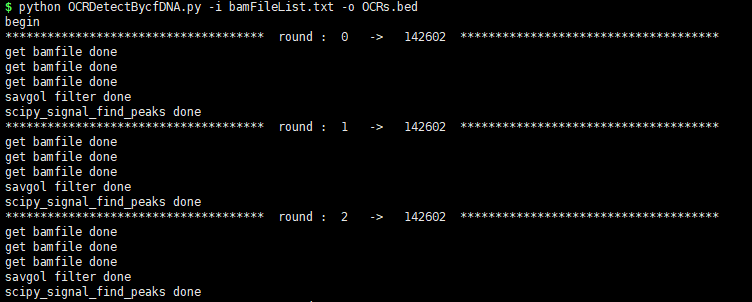

# OCRDetector 
*利用cfDNA-seq数据分析染色质开放区域的工具*  

python运行环境的路径为：“/home/chenlb/anaconda3/bin/python”，推荐使用这个环境，因为有一些包不容易下载

简版代码存储在吉因加服务器上，路径为“/home/chenlb/OCRDetector”，和压缩包的内容差不多。

比较完整的代码存储在“/home/chenlb/MyWpsPro2“路径下面，不过有很多文件，比较乱，不太推荐看，如果一定要看的话，主要涉及的文件有：

DrawTSSWps.py，ExtractWaveformFeaturesByML.py


src文件夹下的OCRDetectBycfDNA.py文件是主要的分析代码，负责初始染色质开放区域的获取

ExtractWaveformFeaturesByML.py文件主要负责提取特征，具体怎么提取特征，可以参考这个文件，不能直接使用

PredictPanel.py是将提取好的特征训练分类器，可以参考一下，不能直接使用。如何将训练好的分类器进行假阳性过滤，可以自己写一下。


*邮箱- chenliubin@stu.xjtu.edu.cn*  

------

**Usage:**   

```shell
python OCRDetectBycfDNA.py [-h usage] [-i input file] [-o OCRs output bed]
```

**Options:**

```shell
-h: usage

-i: bam file list of cfDNA，cfDNA bam文件列表

-o: output file of detected OCRs，输出的染色质开放区域bed文件
```

------

**Example:** 

- `python OCRDetectBycfDNA.py -i bamFileList.txt -o OCRs.bed` 

  或者

-  `python OCRDetectBycfDNA.py -i bamFileList.txt -o OCRs.bed -c -1`

  上述命令可以获得全基因组的染色质开放区域

  

- `python OCRDetectBycfDNA.py -i bamFileList.txt -o OCRs.bed -c 1`

  上述命令可以获得1号染色体的染色质开放区域

  

- `python OCRDetectBycfDNA.py -h`

  *查看用途*


------
**Guidance：**

**Step1:**

首先需要替换bamFileList文件的内容。将文件内容替换成待分析的cfDNA bam文件，一行代表一个bam文件，可以多个文件合并分析。


**Step2:**

`python OCRDetectBycfDNA.py -i bamFileList.txt -o OCRs.bed`

上述命令可以获得初始的染色质开放区域

**Step3:**

提取特征，构建分类器，过滤初始染色质开放区域中存在的假阳性区域。

**Step4:**

使用bedtools 工具分析最终结果与已知的染色质开放区域（基因TSS、ATAC-seq实验提供的结果, Dnase-seq实验提供的结果）的重合情况

------


